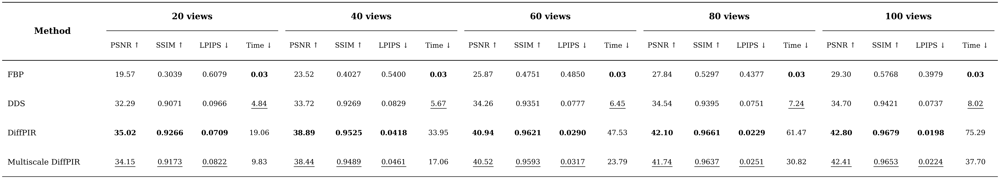
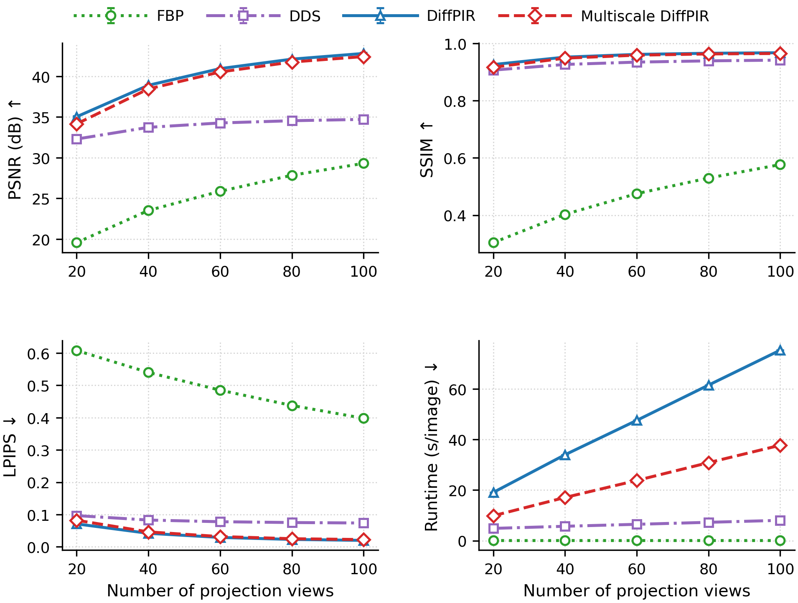
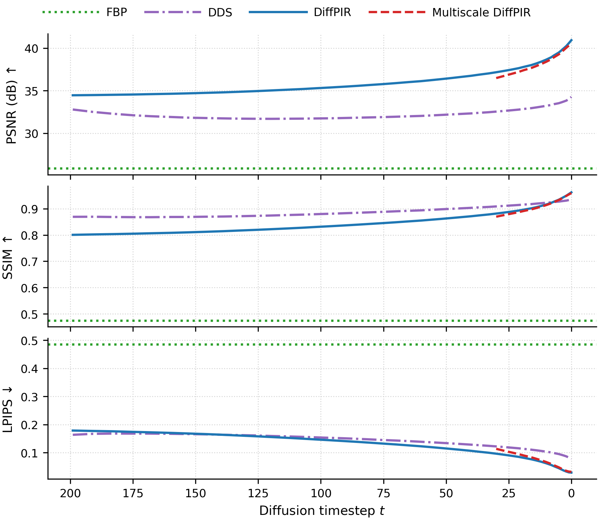
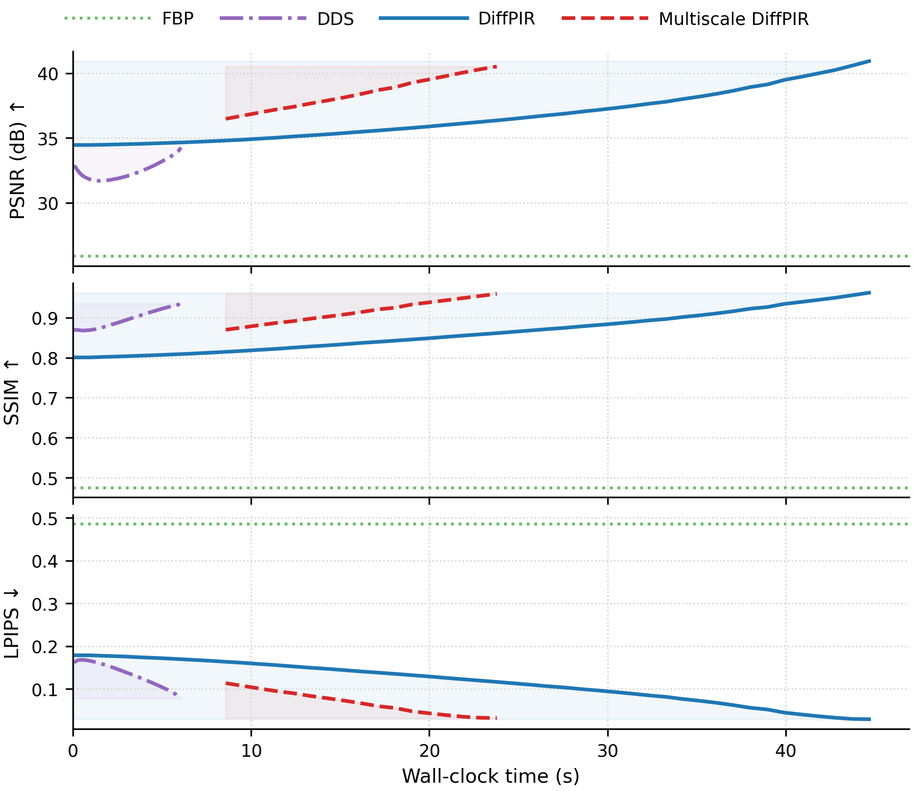

# Multiscale DiffPIR for Sparse-View CT Reconstruction

Posterior sampling for sparse-view computed tomography (CT) reconstruction using a
multiscale diffusion prior, combining DiffPIR with scale-space diffusion ideas.

## Introduction

This repository combines [DiffPIR](https://arxiv.org/abs/2305.08995)
with the scale-space diffusion (SSD) idea: instead of running the full diffusion
reverse process at the native resolution, the sampler progressively refines the
reconstruction from low resolution to high resolution. Coarse scales handle the
global structure cheaply and are used only where they are informative, which
roughly **halves the runtime** compared with single-scale DiffPIR while keeping
reconstruction quality almost unchanged.

## Repository contents

```
├── src/          # Core library: physics (tomography, multiscale), samplers (DiffPIR,
│                 #   DDS, DDPMSampler), diffusion models (UNet), utils
├── experiments/  # Entry-point scripts that run reconstruction on real data
│                 #   (run_diffpir.py, run_comparison.py, ...)
├── plots/        # Plotting scripts that read outputs/ and produce paper figures
├── configs/      # Hydra-style configurations (dataloader, experiment, model, paths)
├── scripts/      # HPC (sbatch) launchers (training scripts not included)
├── assets/       # Figures embedded in this README
└── outputs/      # Experiment results and figures (generated, not committed)
```

## Environment

Tested with the following versions (conda environment `ssd`):

- Python 3.12
- PyTorch 2.4.1 (CUDA 11.8)
- deepinv 0.4.0
- numpy, scipy, pandas, matplotlib, opencv-python, pyyaml
- hydra-core / omegaconf (config composition)
- CTorch (parallel-beam CT projectors/FBP, arXiv:2503.16741)

```bash
conda create -n ssd python=3.12
conda activate ssd
pip install torch==2.4.1 --index-url https://download.pytorch.org/whl/cu118
pip install deepinv==0.4.0 hydra-core omegaconf numpy scipy pandas matplotlib opencv-python pyyaml
```

## Pretrained models

This repository does **not** include model training. It only provides the
posterior-sampling inference code; the diffusion models are trained separately
with a noise-matching objective on images normalized to `[0, 1]`
(corresponding to attenuation values in `[0, 0.04825]`).

Place the three checkpoints (one per resolution level) so that:

```
ddpm_unet_diff_ct_l/ddpm_unet_diff_ct_l0/best_val.pth   # 512 x 512
ddpm_unet_diff_ct_l/ddpm_unet_diff_ct_l1/best_val.pth   # 256 x 256
ddpm_unet_diff_ct_l/ddpm_unet_diff_ct_l2/best_val.pth   # 128 x 128
```

and point `configs/paths/default.yaml` to your `dataset_path` and `weights_dir`.
The model weights are not redistributed with this repository.

## Dataset

The expected layout is one folder per patient containing 512 x 512 slices in
Hounsfield units (HU):

```
data_test/
├── 150/
│   ├── slice_0.npy
│   └── ...
├── 151/
└── ...
```

Preprocessing (see `src/utils/dataloaders.py`): slices are clipped to
`[-1000, 1500]` HU, converted to linear attenuation coefficients
`mu = mu_water * (HU/1000 + 1)` with `mu_water = 0.0193`, and normalized to
`[0, 1]` for the diffusion model. The test split uses patient ids
`150-159` (part of `configs/dataloader/base.yaml`, which is the old config).

The test data used for the reported results cannot be redistributed; please use
your own data with the same layout.

## Usage

Run a quick multiscale DiffPIR reconstruction (single test batch) from the
repository root:

```bash
python experiments/run_diffpir.py
```

Run the multi-method comparison (FBP / DDS / single-scale DiffPIR / multiscale
DiffPIR, 500 test slices, results saved under `outputs/comparison_runs/`):

```bash
python experiments/run_comparison.py
```

> **Note:** the number of projection views is hard-coded in the experiment
> scripts (`n_view=60` in `run_diffpir.py`, `n_view=20` in
> `run_comparison.py`). To evaluate other view counts, edit that value and
> rerun the script.

Generate paper figures from the saved results:

```bash
python plots/plot_paper_metric_summary.py
python plots/plot_time_based_convergence.py
python plots/plot_reconstruction_matrix.py                            # reconstruction matrix figure
python plots/plot_reconstruction_matrix.py --quantitative-table       # quantitative comparison table
```

## Results

Averaged over 500 test slices (a representative sample is shown below; full
figures in `outputs/paper_metric_summary/`). Runtime measured on a single GPU.

<p align="center">
  
</p>

Representative reconstructions: multiscale DiffPIR removes the streak artifacts
of FBP and produces results visually indistinguishable from single-scale
DiffPIR.

### Quantitative comparison

<p align="center">
  
</p>

### Metrics vs. number of views

<p align="center">
  
</p>

All four metrics (PSNR, SSIM, LPIPS, runtime) across 20-100 projection views:
the multiscale sampler tracks single-scale DiffPIR closely in quality at every
view count, while taking roughly **half the runtime**.

### Convergence behavior (60 views)

<p align="center">
  
</p>

<p align="center">
  
</p>

Metric convergence of each method along the diffusion reverse process
(top: vs. diffusion timestep; bottom: vs. wall-clock time). The multiscale
sampler is evaluated only at its final (full-resolution) output; its
intermediate low-resolution stages are not directly comparable with the other
methods.

## Acknowledgments

This work builds on the following papers and code:

- Y. Zhu, K. Zhang, J. Liang, J. Cao, B. Wen, R. Timofte, L. Van Gool,
  *Denoising Diffusion Models for Plug-and-Play Image Restoration* (DiffPIR),
  arXiv:2305.08995. https://github.com/yuanzhi-zhu/DiffPIR
- S. Mukhopadhyay, P. Udhayanan, A. Shrivastava,
  *Scale Space Diffusion* (SSD),
  arXiv:2603.08709. https://prateksha.github.io/projects/scale-space-diffusion/
- H. Chung, J. Kim, M. T. McCann, M. L. Klasky, J. C. Ye,
  *Diffusion Posterior Sampling for General Noisy Inverse Problems* (DPS),
  ICLR 2023, arXiv:2209.14687. https://arxiv.org/abs/2209.14687
  (basis of the DDS baseline in the comparison)
- X. Jiang, G. Gang, J. W. Stayman,
  *CTorch: PyTorch-Compatible GPU-Accelerated Auto-Differentiable Projector
  Toolbox for Computed Tomography*,
  arXiv:2503.16741. https://arxiv.org/abs/2503.16741
- [deepinv](https://deepinv.github.io/) (physics operators, noise models, metrics)
- [openai/guided-diffusion](https://github.com/openai/guided-diffusion) (UNet
  architecture adapted in `src/models/`)
